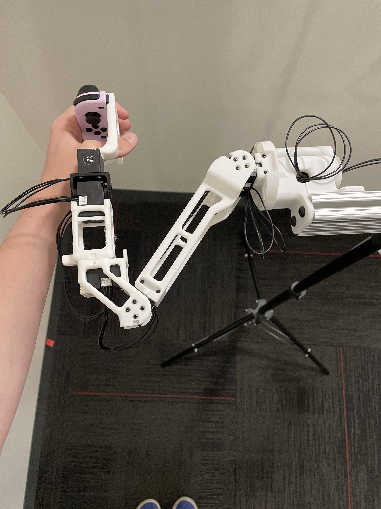
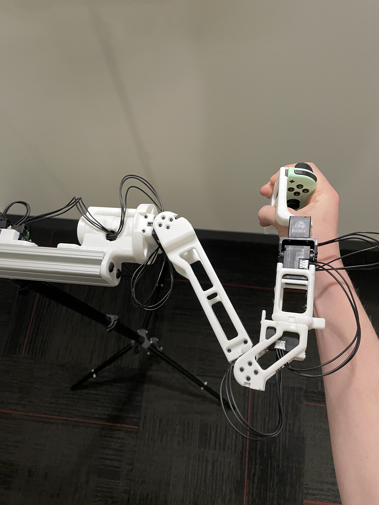
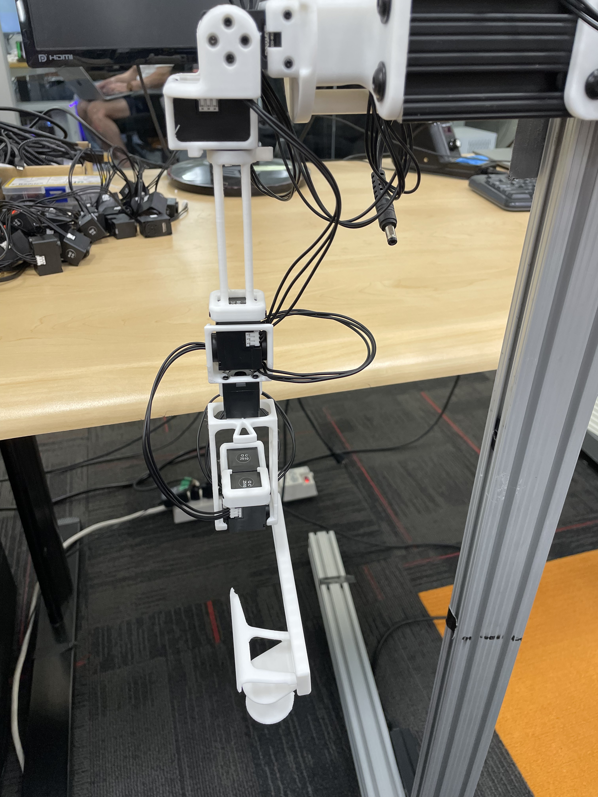
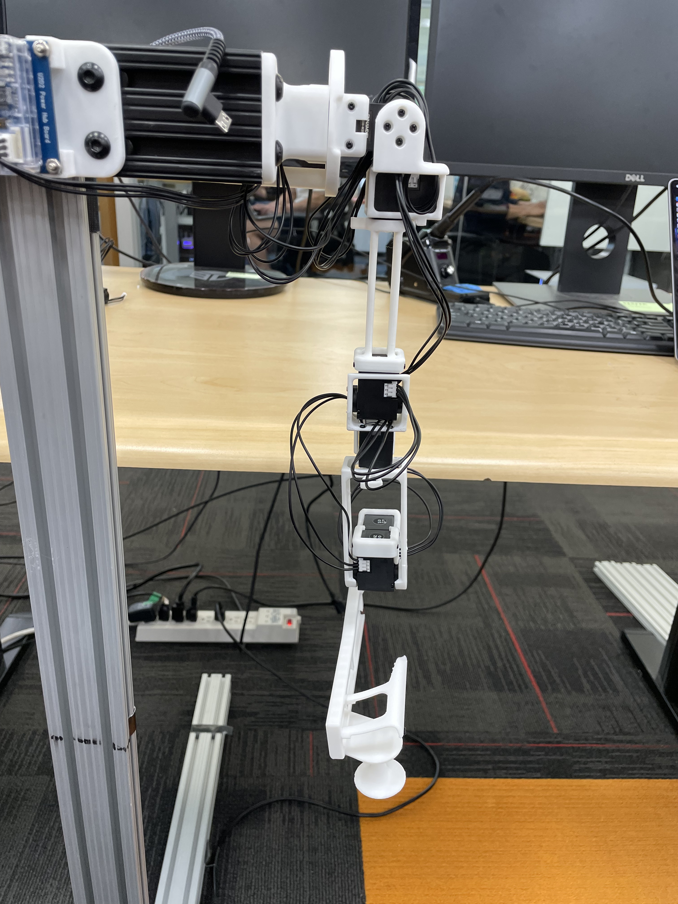
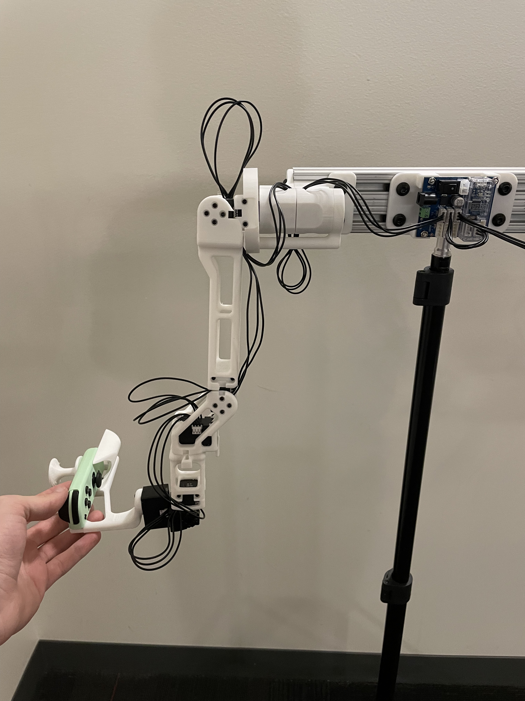
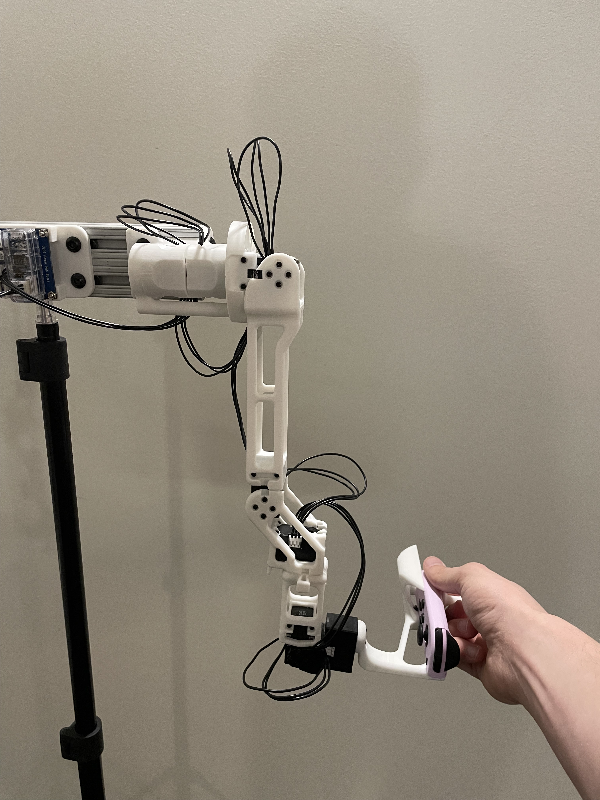
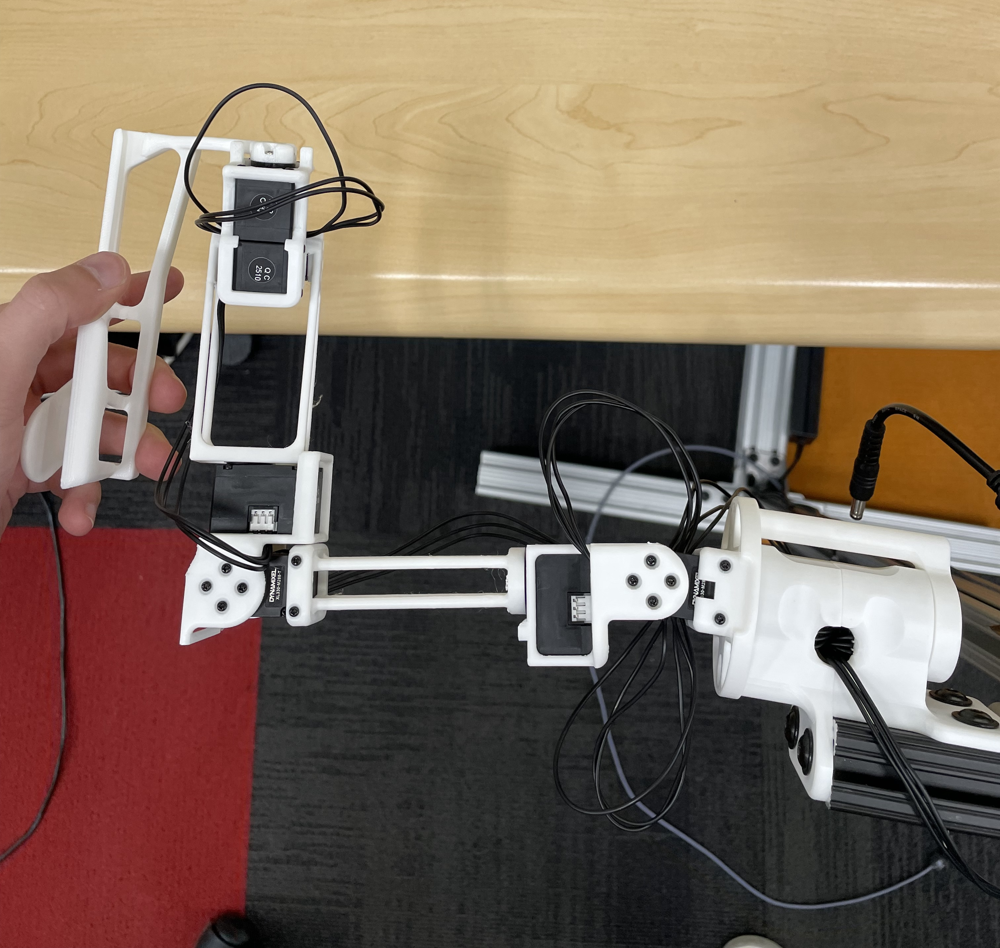
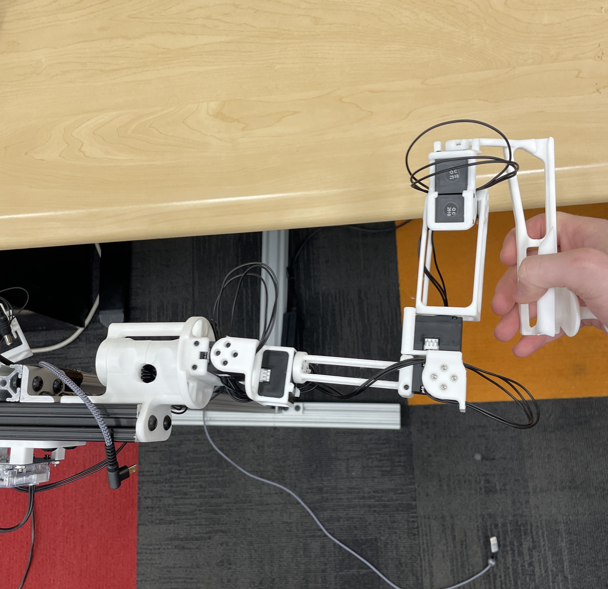

# JoyLo for OmniGibson

## Hardware Setup

For hardware setup, please reference this [guide](https://behavior-robot-suite.github.io/docs/sections/joylo/overview.html) from the [BEHAVIOR Robot Suite](https://behavior-robot-suite.github.io/).

## Software Setup

### Prerequisites

- Linux operating system
- NVIDIA RTX-enabled GPU
- External Bluetooth dongle (recommended: [[link](https://www.amazon.com/dp/B08DFBNG7F/ref=pe_386300_442618370_TE_dp_i1?th=1)])

### Step 1: Environment Setup

1. Create and activate a new conda environment:
```bash
conda create -n omnigibson python=3.10 pytorch torchvision torchaudio pytorch-cuda=12.1 "numpy<2" -c pytorch -c nvidia
conda activate omnigibson
```

### Step 2: OmniGibson Installation

1. Clone OmniGibson repository (use the development branch):
```bash
git clone -b og-develop https://github.com/StanfordVL/OmniGibson.git
cd OmniGibson
pip install -e .
python -m omnigibson.install
```

2. Update assets to the development version:
```bash
# Remove default assets
rm -rf OmniGibson/omnigibson/data/assets

# Clone assets repository (requires access)
git clone https://github.com/StanfordVL/og_assets.git OmniGibson/omnigibson/data/assets

# Install git-lfs if not already installed
sudo apt-get install git-lfs

# Pull large files
cd OmniGibson/omnigibson/data/assets
git lfs pull
```

3. Update dataset to the most recent version:
```bash
# Download the latest dataset
wget https://storage.googleapis.com/gibson_scenes/og_dataset_1_2_0rc2.zip

# Extract and replace the existing dataset
cd OmniGibson
# Optionally backup the original dataset
mv omnigibson/data/og_dataset omnigibson/data/og_dataset_backup
# Extract the new dataset to the correct location
unzip path/to/og_dataset_1_2_0rc2.zip -d omnigibson/data/og_dataset
```

### Step 3: BDDL Repository Setup

1. To be compatible with the most recent task sampling, install the development version of BDDL:
```bash
# First, uninstall any existing BDDL installation
pip uninstall bddl

# Clone the repository and checkout the develop branch
git clone https://github.com/StanfordVL/bddl.git
cd bddl
git checkout develop
pip install -e .
```

### Step 4: JoyLo Repository Setup

1. Clone the JoyLo repository:
```bash
git clone https://github.com/StanfordVL/og-gello
cd og-gello
```

2. Install requirements:
```bash
pip install -r requirements.txt
pip install -e .
```

3. Populate task definitions:
```bash
# Run the script to copy sampled task JSON files to the dataset directory
./populate_behavior_tasks.sh
```

All the sampled tasks are represented as JSON files in the `sampled_task` directory in this repo. You can check the names of all available tasks in the `available_tasks.yaml` file. Usually, tasks are stored in our dataset directory in public releases, but since we are still in the process of iterating on them, we temporarily keep them in this repo so that we can quickly update. OmniGibson still reads from the dataset directory, so we wrote the `populate_behavior_tasks.sh` shell script to help copy these sampled task JSON files over to the dataset directory.

### Step 5: Nintendo JoyCon Configuration

1. Install required packages:
```bash
pip install joycon-python pyglm hid
```

2. Configure udev rules:
```bash
sudo nano /etc/udev/rules.d/50-nintendo-switch.rules
```

3. Add the following content to the file:
```
# Switch Joy-con (L) (Bluetooth only)
KERNEL=="hidraw*", SUBSYSTEM=="hidraw", KERNELS=="0005:057E:2006.*", MODE="0666"

# Switch Joy-con (R) (Bluetooth only)
KERNEL=="hidraw*", SUBSYSTEM=="hidraw", KERNELS=="0005:057E:2007.*", MODE="0666"

# Switch Pro controller (USB and Bluetooth)
KERNEL=="hidraw*", SUBSYSTEM=="hidraw", ATTRS{idVendor}=="057e", ATTRS{idProduct}=="2009", MODE="0666"
KERNEL=="hidraw*", SUBSYSTEM=="hidraw", KERNELS=="0005:057E:2009.*", MODE="0666"

# Switch Joy-con charging grip (USB only)
KERNEL=="hidraw*", SUBSYSTEM=="hidraw", ATTRS{idVendor}=="057e", ATTRS{idProduct}=="200e", MODE="0666"

KERNEL=="js0", SUBSYSTEM=="input", MODE="0666"
```

4. Refresh udev rules:
```bash
sudo udevadm control --reload-rules && sudo udevadm trigger
```

5. Install Bluetooth manager:
```bash
sudo add-apt-repository universe
sudo apt-get install blueman
```

### Step 6: Connect JoyCons

#### Method 1: Using Bluetooth Manager (Recommended)
1. Ensure your external Bluetooth dongle is connected
2. Open Bluetooth Manager
3. Search for JoyCon devices and connect when they appear

#### Method 2: Using Command Line (If Method 1 fails)
1. Run the following commands:
```bash
bluetoothctl
scan on
# Wait for Joy-Con (L) and (R) to appear with their MAC addresses
# For each controller:
pair <MAC_ADDRESS>
trust <MAC_ADDRESS>
connect <MAC_ADDRESS>
```
2. Verify connection: JoyCon lights should be static (not flashing)

### Step 7: Running the System

1. Ensure JoyLo is powered on (with motors NOT connected to Dynamixel software)
2. Ensure JoyCons are connected

3. In one terminal, start the recording environment with a specified task:
```bash
python experiments/launch_nodes.py --recording_path /path/to/recording_file_name.hdf5 --task_name cleaning_up_branches_and_twigs
```

4. In another terminal, run the JoyLo node:
```bash
python experiments/run_r1_gello.py --joint_config_file joint_config_{your specific gello set name}.yaml
```

### Usage Notes

- Press the home button on the right JoyCon to save an episode and reset the scene
- To save all episodes and exit, focus your mouse on the OmniGibson window and press Escape
- Recording file will be saved to the path specified in the launch_nodes.py command
- Fast base motion mode: Activate by pressing down on the left joystick while moving it
- Object visibility toggle: Press A button on the right JoyCon to toggle between hiding non-relevant objects and showing all objects
- JoyCon connection stability: We have noticed that sometimes the JoyCon could disconnect randomly during data collection. A team member has reported that putting the Bluetooth dongle onto USB 2.0 is more stable than USB 3.0. We will look further into this issue.

### Task Information

- Available tasks are listed in `sampled_task/available_tasks.yaml`
- Task definitions are stored as JSON files in the `sampled_task` directory
- To learn about task definitions and expected goal conditions, check the corresponding `problem0.bddl` file in the BDDL repository for the task name. This file contains information about relevant objects, initial conditions, and goal conditions.

## Troubleshooting

### JoyCon connection issues
- If JoyCons won't connect, try the command line method (Method 2 above)
- Ensure you're using an external Bluetooth dongle, as built-in Bluetooth may not be compatible
- Verify that udev rules are properly configured if devices aren't recognized
- If JoyCons disconnect randomly during data collection, try connecting the Bluetooth dongle to a USB 2.0 port instead of USB 3.0
- If the JoyCon is being used as a mouse, double check [this setting](https://askubuntu.com/a/891624) (or alternatively remove `50-joystick.conf` directly)
- If the JoyCons are connected to Ubuntu in bluetooth but are still unable to be detected from Python, try `pip uninstall hidapi`, and then `pip install hid pyglm`, and then try again

## Joycon Button Mapping


## JoyLo Joint Calibration
- JoyLo sets can be assembled in slightly different ways, resulting in different orientations of the motors and offsets between the physical motor positions and the joint positions in simulation. 
- A script for automatically determining these joint signs and offsets is available in `scripts/calibrate_joints.py`

### Example Usage
```
python scripts/calibrate_joints.py --robot R1 --gello_name {YOUR_GELLO_NAME_HERE}
```
(Make sure to specify the same `gello_name` argument when using your set to run the simulation).

### Reference Positions
The calibration script requires each arm to be placed in two fixed reference positions, called the "zero" and "calibration" positions. These are provided below for both the R1 (6-DOF) and R1-Pro (7-DOF) JoyLo variants.

|                      | R1 (6-DOF) | R1-Pro (7-DOF) |
|----------------------|----------- |----------------| 
| Zero Position        |   |                 |
| Calibration Position |   **NOTE: Take from the front - note the forwards orientation of the notch on the wrist joint**|  |